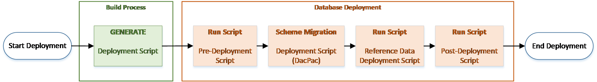

# SSDT Data Migration
The SSDT Data Migration extension offers an advanced script based management for database scheme migrations. The main functionality is provided by a fully customizable and self-managed pre-, post and reference data script execution. 

## Intro
SSDT is a database development tooling fully integrated into Microsoft Visual Studio. It supports database scheme migrations out of the box using DACPAC definition files and consist of an integrated single pre- and post script file capability. In practice more complex environments and database deployment scenarios require additional logic which requires an extended migration management. 

The SSDT Data Migration Scripts extension provides additional logic and management to meet the complexity for database deployments.

### Database Deployment Flow
Based on the single pre-, post and reference data scripts the extension allows to use multiple managed sub-deployment scripts:
 - Pre-Scripts
     - ...must be used with caution as the target database is in an undefined state as long as the actual scheme update has not been executed. Especially, if the database does not yet exist on the target server there is no way to run any of the pre-deployment scripts. must be used with 
 - Post-Scripts
     - ...are less critical compared to pre-scripts since the scheme migration has been executed in advance and provides an upgraded and consistent target database scheme.
 - Reference Data Scripts
     - ...are used for data which is needed by the application logic (extendable business logic, configuration, translations, etc...). Reference data should always be consistent with the application binaries. Most often, reference data uses merge statements for static reference table contents.

The following illustration shows the basic deployment flow using SSDT and the script extensibility features. All scripts and scheme migrations are bundled as artifacts during the build process and published onto the database by the dacfx framework at deployment time. 



## Build (and publish) a .dacpac (SQL Server database project) with .NET Core
The cross-platform version of sqlpackage allows publishing a .dacpac package for quite some time. Though building the database project (.sqlproj) was only possible on Windows because the .sqlproj project file is based on the full .NET Framework. The [MSBuild.Sdk.SqlProj](https://github.com/rr-wfm/MSBuild.Sdk.SqlProj) project finally allows to build the .dacpac file also on Mac or Linux.

## Getting started
These instructions will get you a sample of the SSDT project up and running on your local machine for development and testing purposes.

### Prerequisites
This chapter lists all prerequisites which have to be met to run the extension locally or on build servers.
- Install **SQL Server Data Tools**  Visual Studio component (*Visual Studio Installer | Modify | Individual Components | Cloud, database and server | SQL Server Data Tools*)
- Install **4tecture.CustomSSDTMigrationScripts.msi** extension from the releases section.

### Setup Sample - SQL Server Database project
Use the samples project ending with "*.Sample" from the *Sample* folder as the initial template project or follow these instructions (using default configuration settings):
1. Create a new SQL Server Database project
2. On the root level of the project create the following folder structure and files with the given build option:
    ```
    |-Scripts
        |-PostScripts (folder)
            |-{yourPostScript1.sql} (Build Action = None)
            |-...
        |-PreScripts (folder)
            |-{yourPreScript1.sql} (Build Action = None)
            |-...    
        |-ReferenceDataScripts (folder)
            |-{yourPostScript1.sql} (Build Action = None)
            |-...
        |-Script.PostDeployment.sql (Build Action = PostDeploy)
        |-Script.PreDeployment.sql (Build Action = PreDeploy)
    |-Tables
        |-_MigrationScriptsHistory.sql (Build Action = Build)
    |-Scripts.targets
    ```
    - The migration scripts history table (*_MigrationScriptsHistory.sql*) is mandatory and must be setup with the following data definition language template:
        ```sql
        CREATE TABLE [dbo].[_MigrationScriptsHistory]
        (
            [ScriptNameId] NVARCHAR(255) NOT NULL PRIMARY KEY, 
            [ExecutionDate] DATETIME2 NOT NULL, 
            [ScriptHash] NVARCHAR(255) NOT NULL
        )

        ```
    - The SQL pre-script (*Script.PreDeployment.sql*) must be setup as follow:
        ```sql
        :r .\RunPreScriptsGenerated.sql
        ``` 
    - The SQL post.script (*Script.PostDeployment.sql*) must be initialized as followed:
        ```sql
        :r .\RunReferenceDataScriptsGenerated.sql
        :r .\RunPostScriptsGenerated.sql
        ```
    - The project targets  (*Scripts.targets*) must be initialized as followed:
        ```xml
        <?xml version="1.0" encoding="utf-8"?>
        <Project DefaultTargets="Build" xmlns="http://schemas.microsoft.com/developer/msbuild/2003" ToolsVersion="4.0">
          <Import Project="$(MSBuildExtensionsPath)\4tecture\build\CustomSSDTMigrationScripts.props" Condition="Exists('$(MSBuildExtensionsPath)\4tecture\build\CustomSSDTMigrationScripts.props')" />
        </Project>
        ```

3. Open the .sqlproj project file in a text editor and add the following project import statement for the targets file within the projects root element:

    ```xml
    <Project DefaultTargets="Build" xmlns="http://schemas.microsoft.com/developer/msbuild/2003" ToolsVersion="4.0">
        <Import Project=".\Scripts.targets" />
        ...
    </Project>
    ```  
4. Rebuild your SSDT project and verify if the following files have been generated within the Script subfolder:

    - RunPostScriptsGenerated.sql
    - RunPreScriptsGenerated.sql
    - RunReferenceDataScriptsGenerated.sql

### Setup Sample - Add a cross-platform .dacpac build project to an existing solution with an existing SQL Server Database project
Use the sample project ending with ".Sample.Build" from the *Sample* folder as the initial template project or follow these instructions (using the default configuration settings):

1. Create .NET Standard Class Library
2. Open the .csproj file and change the Sdk value and define the [SQL Server target](https://docs.microsoft.com/dotnet/api/microsoft.sqlserver.dac.model.sqlserverversion):
    ```xml
    <Project Sdk="Microsoft.NET.Sdk">

    <PropertyGroup>
        <TargetFramework>netstandard2.0</TargetFramework>
    </PropertyGroup>
    ```
    to
    ```xml
    <Project Sdk="MSBuild.Sdk.SqlProj/1.9.0">
    
    <PropertyGroup>
        <TargetFramework>netstandard2.0</TargetFramework>
        <SqlServerVersion>Sql130</SqlServerVersion>
    </PropertyGroup>
    ```
3. Add the nuget package reference to add the Custom SSDT extension
    ```xml
    <ItemGroup>
        <PackageReference Include="4tecture.CustomSSDTMigrationScripts" Version="1.2.0">
        <PrivateAssets>all</PrivateAssets>
        <IncludeAssets>runtime; build; native; contentfiles; analyzers; buildtransitive</IncludeAssets>
        </PackageReference>
    </ItemGroup>
    ```

4. On the root level of the project create the following folder structure and files:
    ```
    |-Scripts
        |-PostScripts (folder)
            |-.gitkeep (empty file to let git know to keep the empty folder)
        |-PreScripts (folder)
            |-.gitkeep (empty file to let git know to keep the empty folder)
        |-ReferenceDataScripts (folder)
            |-.gitkeep (empty file to let git know to keep the empty folder)
        |-Script.PostDeployment.sql
        |-Script.PreDeployment.sql
    ```
    - The SQL pre-script (*Script.PreDeployment.sql*) must be setup as follow:
        ```sql
        :r .\RunPreScriptsGenerated.sql
        ``` 
    - The SQL post.script (*Script.PostDeployment.sql*) must be initialized as followed:
        ```sql
        :r .\RunReferenceDataScriptsGenerated.sql
        :r .\RunPostScriptsGenerated.sql
        ```
5. Add a link in the new .csproj to the .sql scripts in your existing database project
    ```xml
    <ItemGroup>
        <Content Include="{Relativ-SQL-Server-Database-Project-Path}\Functions\**\*.sql">
            <Link>Functions\%(RecursiveDir)%(Filename)%(Extension)</Link>
        </Content>
        <Content Include="{Relativ-SQL-Server-Database-Project-Path}\Snapshots\**\*.sql">
            <Link>Snapshots\%(RecursiveDir)%(Filename)%(Extension)</Link>
        </Content>
        <Content Include="{Relativ-SQL-Server-Database-Project-Path}\StoredProcedures\**\*.sql">
            <Link>StoredProcedures\%(RecursiveDir)%(Filename)%(Extension)</Link>
        </Content>
        <Content Include="{Relativ-SQL-Server-Database-Project-Path}\Tables\**\*.sql">
            <Link>Tables\%(RecursiveDir)%(Filename)%(Extension)</Link>
        </Content>
        <Content Include="{Relativ-SQL-Server-Database-Project-Path}\UserDefinedDataTypes\**\*.sql">
            <Link>UserDefinedDataTypes\%(RecursiveDir)%(Filename)%(Extension)</Link>
        </Content>
        <Content Include="{Relativ-SQL-Server-Database-Project-Path}\Views\**\*.sql">
            <Link>Views\%(RecursiveDir)%(Filename)%(Extension)</Link>
        </Content>
        <None Include="{Relativ-SQL-Server-Database-Project-Path}\Scripts\PostScripts\**\*.sql">
            <Link>Scripts\PostScripts\%(RecursiveDir)%(Filename)%(Extension)</Link>
        </None>
        <None Include="{Relativ-SQL-Server-Database-Project-Path}\Scripts\PreScripts\**\*.sql">
            <Link>Scripts\PreScripts\%(RecursiveDir)%(Filename)%(Extension)</Link>
        </None>
        <None Include="{Relativ-SQL-Server-Database-Project-Path}\Scripts\ReferenceDataScripts\**\*.sql">
            <Link>Scripts\ReferenceDataScripts\%(RecursiveDir)%(Filename)%(Extension)</Link>
        </None>
        <None Include="{Relativ-SQL-Server-Database-Project-Path}\{SQL-Server-Database-Project}.refactorlog" Link="{SQL-Server-Database-Project}.refactorlog" />
    </ItemGroup>
    ```

6. Define the actions to the created script files, link and use the source .refactorlog:
    ```xml
    <ItemGroup>
        <PostDeploy Include="Scripts\Script.PostDeployment.sql" />
        <PreDeploy Include="Scripts\Script.PreDeployment.sql" />
        <RefactorLog Include="{Relativ-SQL-Server-Database-Project-Path}\{SQL-Server-Database-Project}.refactorlog" />
    </ItemGroup>

    <ItemGroup>
        <Content Remove="Scripts\RunPostScriptsGenerated.sql" />
        <Content Remove="Scripts\RunPreScriptsGenerated.sql" />
        <Content Remove="Scripts\RunReferenceDataScriptsGenerated.sql" />
        <Content Remove="Scripts\Script.PostDeployment.sql" />
        <Content Remove="Scripts\Script.PreDeployment.sql" />
    </ItemGroup>
    ```

7. Rebuild your .Net Standard Class Library project and verify if the following files have been generated within the Script subfolder:

    - RunPostScriptsGenerated.sql
    - RunPreScriptsGenerated.sql
    - RunReferenceDataScriptsGenerated.sql

### Extend .gitignore
It's recommended to add the auto-generated files to the git ignore file:
```
    {SQL-Server-Database-Project-Path}/Scripts/RunReferenceDataScriptsGenerated.sql
    {SQL-Server-Database-Project-Path}/Scripts/RunPreScriptsGenerated.sql
    {SQL-Server-Database-Project-Path}/Scripts/RunPostScriptsGenerated.sql

    {Net-Standard-Project-Path}/Scripts/RunReferenceDataScriptsGenerated.sql
    {Net-Standard-Project-Path}/Scripts/RunPreScriptsGenerated.sql
    {Net-Standard-Project-Path}/Scripts/RunPostScriptsGenerated.sql
```

## Configuration
The extension can be easily adapted to your needs by using a json configuration file. The configuration file must be placed beside the SSDT project file named **ssdt.migration.scripts.json** The following snipped shows all available options where each of the supported script type can be individually configured.
```json
{
  "PreScripts": {
    "ScriptBaseDirectory": "<Value>",
    "ScriptNamePattern": "<Value>",
    "ScriptRecursiveSearch": "<Value>",
    "GeneratedScriptPath": "<Value>",
    "ExecutionFilterMode": "<Value>",
    "ExecutionFilterValue": "<Value>",
    "TreatScriptNamePatternMismatchAsError": "<Value>",
    "TreatHashMismatchAsError": "<Value>"
  },

  "PostScripts": {
    // ...
  },

  "ReferenceDataScripts": {
    // ...
  }
}
```

| Configuration | Description |
| ------------- | ----------- |
| ScriptBaseDirectory | The base directory where to store the target script type.
| ScriptNamePattern | The naming convention pattern used to validate and determination of execution order. 
| ScriptRecursiveSearch | Indicates whether scripts are searched recursively from the base directory
| GenerateScriptPath | Path to the generated scripts
| ExecutionFilterMode | The execution filter mode defines the strategy to use for execution order
| ExecutionFilterValue | The corresponding value based on the selected filter mode
| TreatScriptNamePatternMismatchAsError | Indicates how pattern mismatches should be handled. Throws an error if enabled and any mismatch is detected
| TreatHashMismatchAsError | If set to true any script change of already executed scripts will throw an error (hash based calculation). This rule does not apply to reference data scripts.

### Pre Configurations

|           | Default Value | Options |
|-----------|---------------|-----------------|
| ScriptBaseDirectory | {root}\Scripts\PreScripts | - |
| ScriptName Pattern | ^(\d{14})_(.*).sql | - |
| ScriptRecursiveSearch | true | *true* \| *false*
| GeneratedScriptPath | {root}\Scripts\RunPreScriptsGenerated.sql | - |
| ExecutionFilterMode |  all | *all* \| *count* \| *days* \| *date*
| ExecutionFilterValue | null
| TreatScriptNamePatternMismatchAsError | true | *true* \| *false*
| TreatHashMismatchAsError | true | *true* \| *false*

### Post Configurations

|           | Default Value | Options |
|-----------|---------------|-----------------|
| ScriptBaseDirectory | {root}\Scripts\PostScripts | - |
| ScriptName Pattern | ^(\d{14})_(.*).sql | - |
| ScriptRecursiveSearch | true | *true* \| *false*
| GeneratedScriptPath | {root}\Scripts\RunPostScriptsGenerated.sql | - |
| ExecutionFilterMode |  all | *all* \| *count* \| *days* \| *date*
| ExecutionFilterValue | null
| TreatScriptNamePatternMismatchAsError | true | *true* \| *false*
| TreatHashMismatchAsError | true | *true* \| *false*

### Reference Data Configurations

|           | Default Value | Options |
|-----------|---------------|-----------------|
| ScriptBaseDirectory | {root}\Scripts\ReferenceDataScripts | - |
| ScriptName Pattern | ^(\d+)_(.*).sql | - |
| ScriptRecursiveSearch | true | *true* \| *false*
| GeneratedScriptPath | {root}\Scripts\RunReferenceDataScriptsGenerated.sql | - |
| ExecutionFilterMode |  all | *all* \| *count* \| *days* \| *date*
| ExecutionFilterValue | null
| TreatScriptNamePatternMismatchAsError | true | *true* \| *false*
| TreatHashMismatchAsError | true | *true* \| *false*

## About
This extension has been developed by consultants of [4tecture](https://www.4tecture.ch) based on their experience from many DevOps projects. Originally it was developed internally without public scope. However, we decided to make this open source so others can benefit, too. 

Feedback is very welcome. Please open an issue on GitHub or send us a message through our website.

